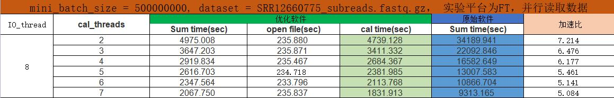
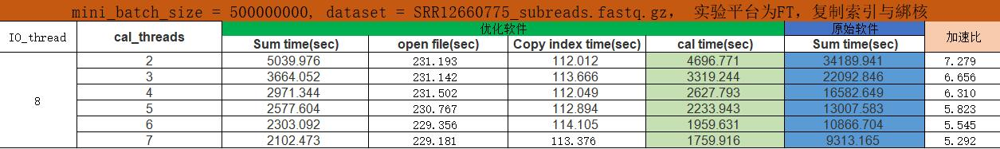
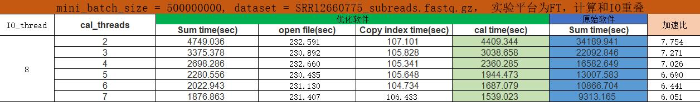

# 实验框架
1. 实验一：并行读取数据
   1. 使用两组三代数据测试效果
   2. 使用两组二代数据测试效果
2. 实验二：复制索引与绑核
   1. 使用两组三代数据测试效果
   2. 使用两组二代数据测试效果
3. 实验三：计算和IO重叠
   1. 使用两组三代数据测试效果
   2. 使用两组二代数据测试效果
# 实验进度
1. FT服务器：三代数据已跑好
2. AMD服务器：三代数据已跑好
3. Intel服务器：三代数据已跑好，跑了一组二代数据
# 实验效果示例
以FT为例：

